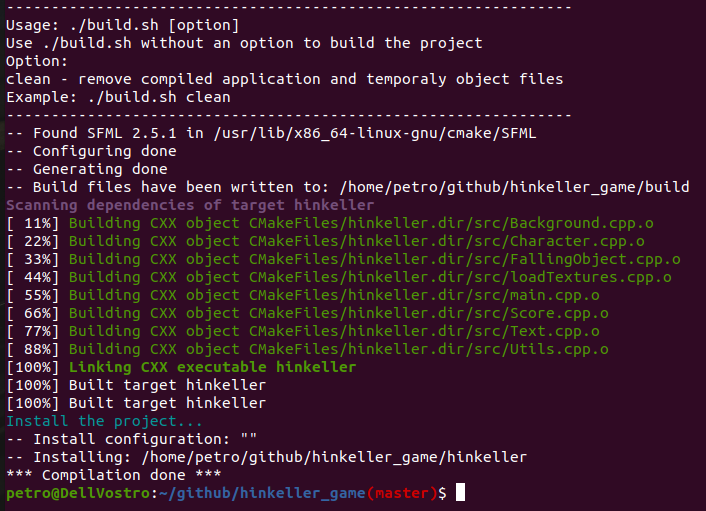
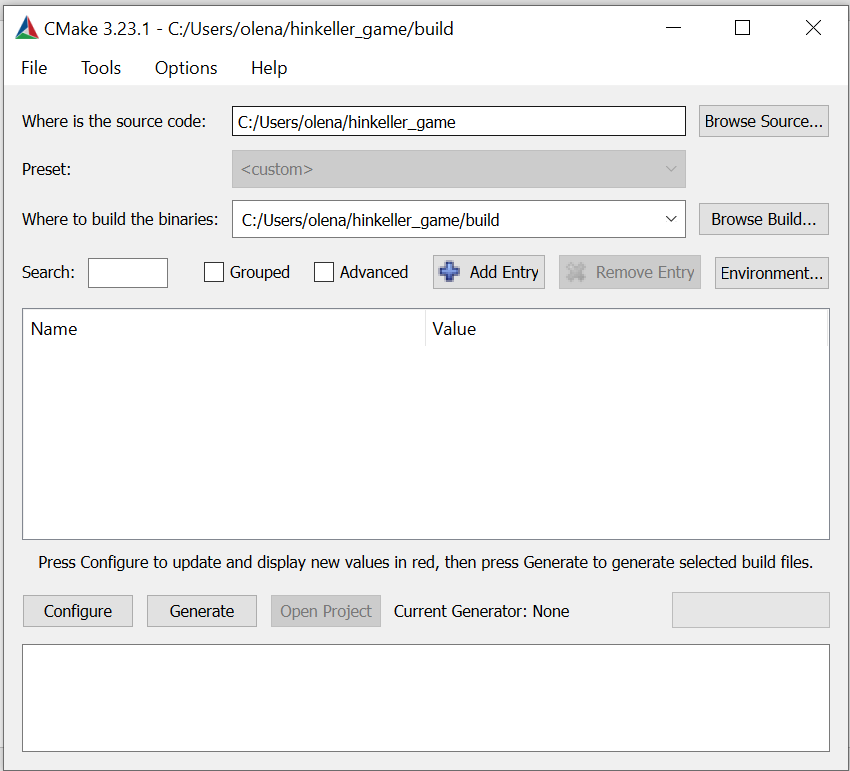
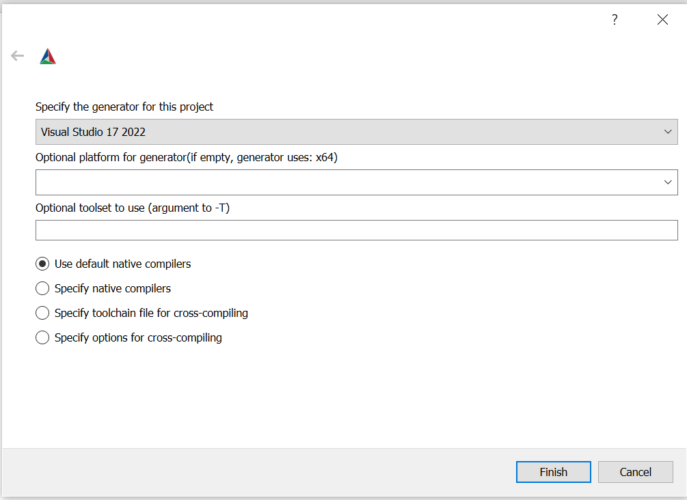
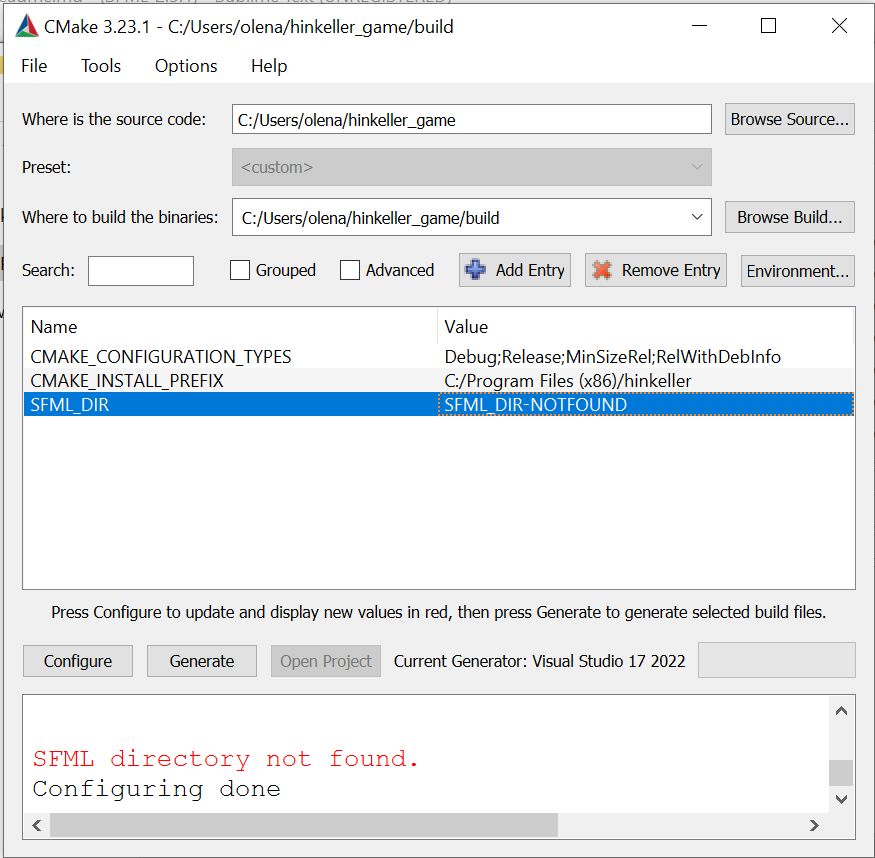
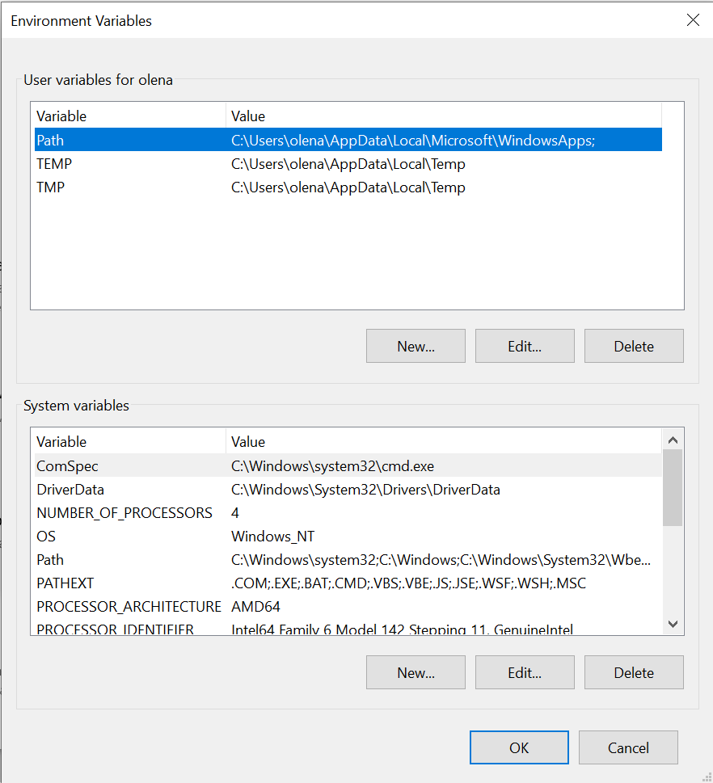
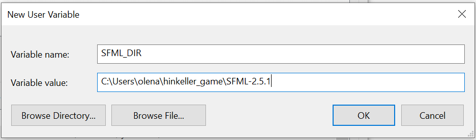
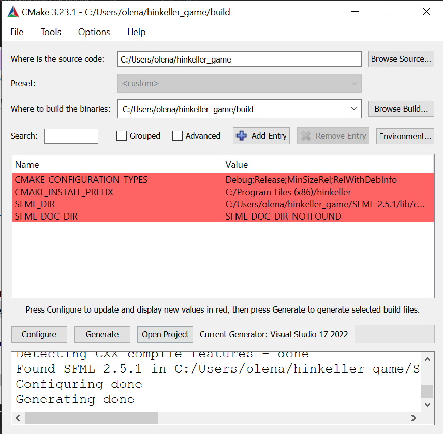
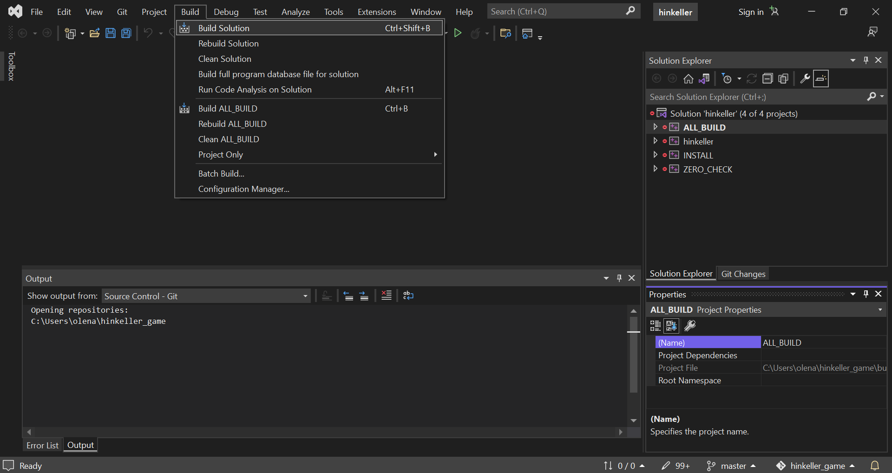

<h2>How to build the project</h2>
<h3>Overview</h3>
At least three operating systems are supported:
<ul>
<li>OSX</li>
<li>Linux</li>
<li>Windows</li>
</ul>
<h3>Compilation</h3>

The compilation process is described for each operating system in the appropriate section.

<h4>Ubuntu Linux</h4>
<ol>
<li>Install the required tools (Git, CMake, g++):</li>

~~~
$ sudo apt install git cmake g++ -y
~~~

<li>Install the SFML library:</li>

~~~
$ sudo apt install libsfml-dev -y
~~~

<li>Compile the project just by launching build.sh:</li>

~~~
$ ./build.sh
~~~

</ol>

<h4>Windows</h4>
<ol>
<li>Download Git for Windows by the link https://git-scm.com/download/win.</li>

Launch the installation package and follow the instructions.

Open menu item Start->Git->Git Bash then clone the repository:

~~~
$ git clone https://github.com/Vladddd46/hinkeller_game.git
~~~

<li>Download the SFML library by the link https://www.sfml-dev.org/download.php.</li>

Extract SFML from the archive and place it somewhere on your file system.

Copy all dll files from SFML/bin to Windows/System32 directory.

<li>Download Microsoft Visual Studio Community Edition for free by the link https://visualstudio.microsoft.com/vs/community/.</li>

Then launch the installation package and follow the instructions.
 

<li>Download and install CMake using the link https://cmake.org/download/.</li>

<li>Configure and build the project:</li>
<ul>
<li>Launch CMake using menu item Start->CMake (cmake-gui) and select the hinkeller project directory:

</li>
<li>Select a Visual Studio version by clicking the Configure button:

</li>
<li>Click the Configure button again:

</li>

As you can see, SFML_DIR was not found. You should set this environment variable manually.

Open Windows System Properties, click the Environment Variables button then add the SFML_DIR variable that should contain the SFML library path:

<li>After doing actions above, select the CMake window and click the buttons in the following order: Configure, Generate, Open Project:

</li>

<li>If Visual Studio is installed on your PC, it will be launched immediately.</li>

Select Build->Build Solution in the main menu to compile the project:

After building you can run the game by double-clicking on the hinkeller.exe file.

</ul>
</ol>
